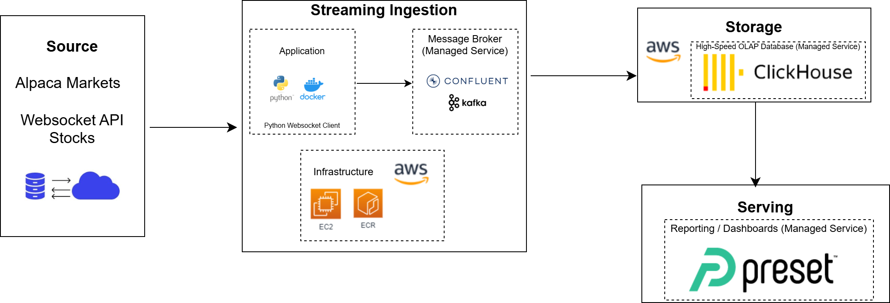

# Streaming pipeline with Apache Kafka and Clickhouse

## Summary

This project demonstrates a cloud-native, high-performance data pipeline designed to capture real-time financial data from Alpaca Markets and convert it into actionable insights using BI tools such as Preset. The solution leverages Apache Kafka for streaming ingestion and ClickHouse for ultra-fast analytics, enabling minute-by-minute processing of live stock market data. 
The primary challenge was architecting a scalable, cloud-based system capable of delivering real-time analytics on continuously streaming financial data.

## Objective 

This cloud-hosted pipeline delivers real-time analysis of stock market data streamed every minute via API access using WebSocket connections. To optimize scalability and cost, the solution is configured to run at one-minute intervals for a limited duration and processes only a select set of stock tickers.

## Consumers

BI analysts will consume the data via BI tools like Preset. 

## Project Structure

stream-elt/: End-to-end integration of streaming data pipelines for seamless data processing. See details here: [stream-elt](/stream-elt/)

    docker-compose.yml     # Docker setup
    Dockerfile             # Container build instructions
    producer.py            # Source code
    requirements.txt       # Dependencies
    template.env           # API keys and secrets

## Pipeline solution

- Alpaca WebSocket API: Streams stock market data at 1-minute intervals.
- Python & Docker: A Python-based data producer, containerized with Docker and deployed on AWS ECS, ingests the streaming data.
- Confluent Cloud & Apache Kafka: Kafka serves as the backbone for real-time data processing and routing, delivering the stream to ClickHouse.
- ClickHouse Cloud: A high-performance, columnar database optimized for real-time analytics and fast query execution.
- Apache Preset: A Business Intelligence (BI) platform for creating interactive dashboards and visualizing real-time stock data.

## Solution Architecture

