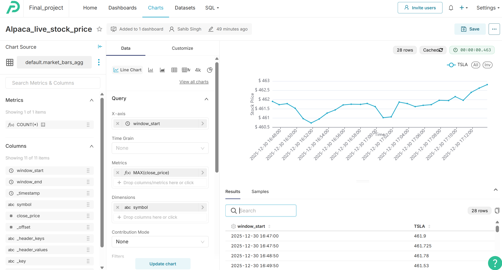
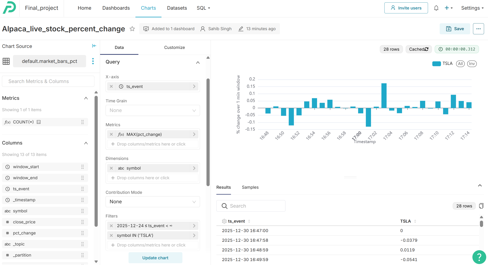
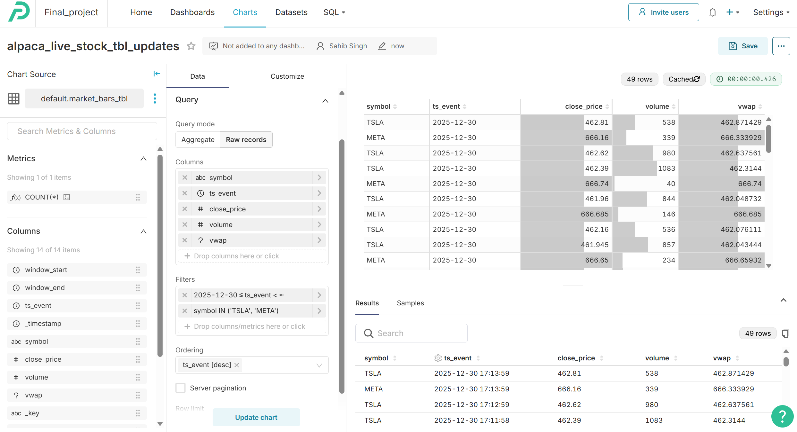
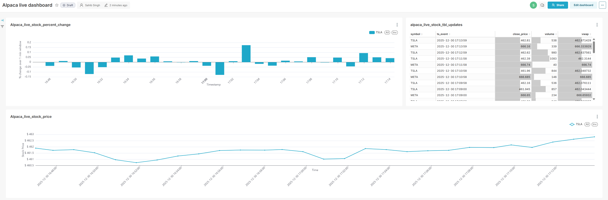

# Clickhouse Streaming Data

#### In the Preset dashboard, three charts were created using data from ClickHouse:

- Line Chart: Displays the live stock price over time.
- Bar Chart: Shows the percentage change calculated for each one-minute window.
- Data Table: Lists key metrics including stock price, trading volume, volume-weighted average price (VWAP), and timestamp.

#### The dashboard is configured to refresh every minute, ensuring it reflects the latest streaming data.

## Charts and Dashboards

